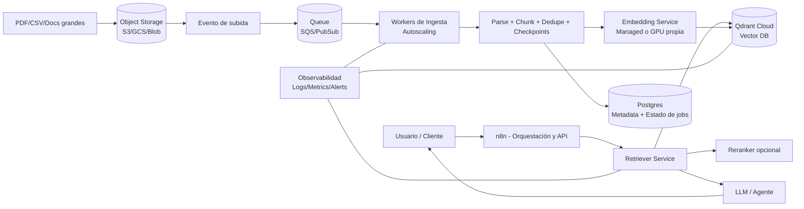

# 📚 Documentación del Proyecto

Documentación técnica y arquitectura del stack n8n + WAHA + Qdrant.

## Contenido Planeado

- `architecture.md` - Diagrama de arquitectura completo
- `setup.md` - Guía detallada de instalación y configuración
- `api-reference.md` - Referencia de APIs disponibles
- `deployment.md` - Guía de deployment a producción
- `troubleshooting.md` - Problemas comunes y soluciones

## Stack Tecnológico

- **n8n**: Orquestación de workflows
- **WAHA**: WhatsApp HTTP API
- **Qdrant**: Vector database para RAG
- **PostgreSQL**: Base de datos relacional
- **Docker**: Containerización
- **Python**: Scripts de automatización

## Flujo de Datos

```
WhatsApp → WAHA → n8n → [Export Script] → .txt files
                    ↓
                 Qdrant (vectores) + Postgres (metadata)
                    ↓
                 RAG Context → Auto-respuestas
```

## Arquitectura a Futuro (Cloud + RAG Escalable)



Notas rápidas:
- n8n se mantiene liviano: dispara jobs y consume retrieval, no hace ETL pesado.
- Ingesta asíncrona por cola para evitar timeouts con archivos grandes.
- Retrieval desacoplado para poder mejorar ranking sin tocar la ingesta.
